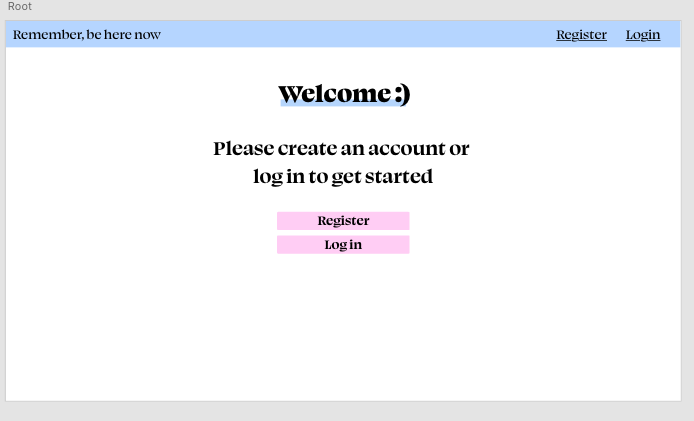
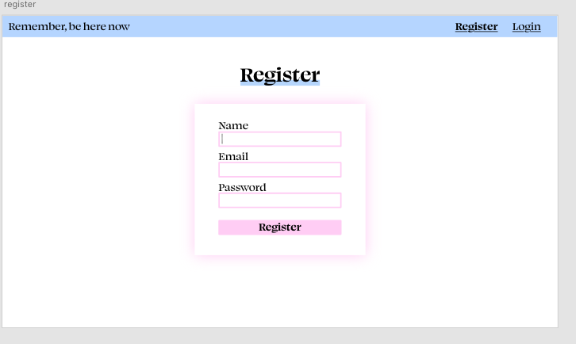
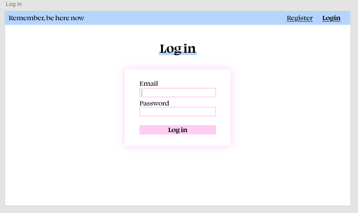
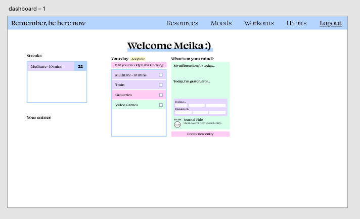
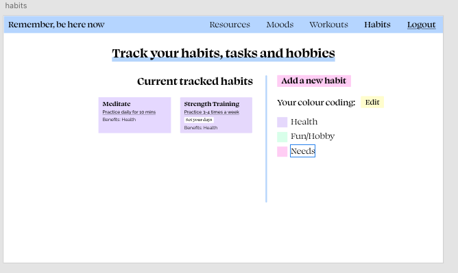
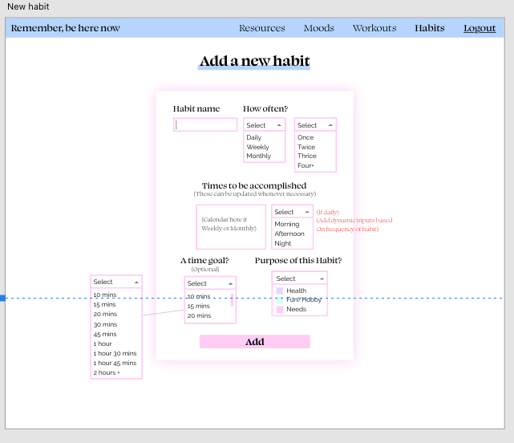
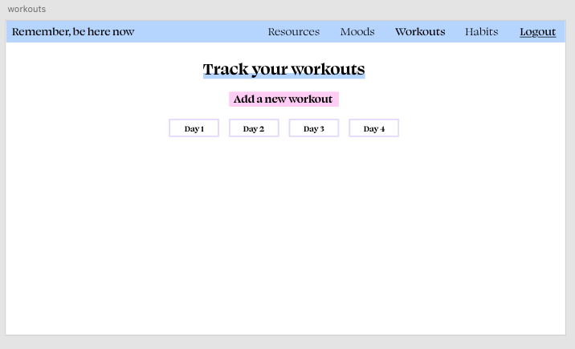

# Mental Health App

I've decided to create this application as a side project to help myself in managing my life and improving all different areas of my own health. I want one place where i can organise my daily tasks, track my habits and my moods, keep a personal journal, track my workouts and set goals. I'm also using this project to improve my knowledge in ~~react-redux~~, the backend, databases as well as keeping my tech skills up to date and continuing my learning.

 I've temporarily used the title, "Remember, be here now" in the logo section of the navbar, referencing the book by Ram Dass with the same title. I personally love this phrase as a reminder to stay present in my life. 

In regards to the design of this application, I've decided to use a colour palette of soft pastel colours because I feel they are colours that are quite soothing and gentle. If this project was going to be used by people other than myself, I would most likely change them due to contrast accessability reasons, but as It's mostly being used to challenge myself, be creative and continue learning I will use this colour palette.

## Features

- **Mood tracker**
  - Daily task:
    - Every day enter a quick questionaire on how im feeling at that time, followed by a journal entry and gratitude.
  - What is in the questionnaire?
    - How are you feeling on a scale?
      -  (1 - 5 shown as happy to sad face )
    - How would you describe your mood today?
      - (List of emotions to choose from as checkboxes)
      - What are the options?
    - What is making you feel this today?
      - (List of things as possible causes as checkboxes)
      - What are the options?
    - Move on to journal section
    - Then onto gratitude section
      - What are you grateful for today?
        - Dynamic input?
        - Display on dashboard
  - Displaying mood entry data
    - Show on the dashboard
    - Graph?
    - Table?
    - Infographic?
    - Calculate statistics and show them?

- **Affirmations**
  - Have a collection of default affirmations
  - Ability to add own affirmations to list
  - Show an affirmation for the day, randomized on each day

- **Habit tracker**
  - Daily to do list?
    - Set a list of habits to do every day
    - Set a list of habits to do every few days, weekly or monthly
  - Streaks for habits to be done every day?

- **Goals? (maybe connect with streaks in some way?)**
  - Set goals, put a plan in place to work towards those goals

- **Workout Tracker (Backlog)**
  - FInish these features before implementing ^

- **Resources (Backlog)**
  - Numbers for suicide prevention and related
  - List of books
  - Meditation information and links
  - Podcasts?
  - Spirituality related things?
  - Fun interesting things
    - Birth Chart Calculater
    - 61? personality quiz
    - Music playlists

## Wireframes

**Welcome page progression**

**Authentication pages progression**

**Dashboard progression**

**Habits page progression**

**Habit forms progression**

**Workouts progression**

## Trello

## User Stories

